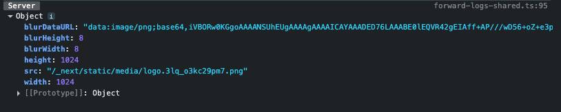

# NEXT JS with Krishan!

### What is Next JS (nextjs.org)

- NextJS is an open source framework built on the top of React to build scalable full-stack applications.
- It blends frontend + backend in the same project
- Routes are configured via filesystem (foldes + files), no code based configuration or extra packages for routing is required.
- All the pages and components are server-side rendered.

---

### Creating First Next App
- you should have node js in your pc/laptop
 - you can visit `https://www.nextjs.org` for all the documentation
 - in your terminal use this command :
    `npx create-next-app@latest`
- navigate to the project you just made, and to start the project use `npm run dev`

[this is the expected new Website]
---
### Two Different Approaches for building Next JS
-> App Router / Page Router 