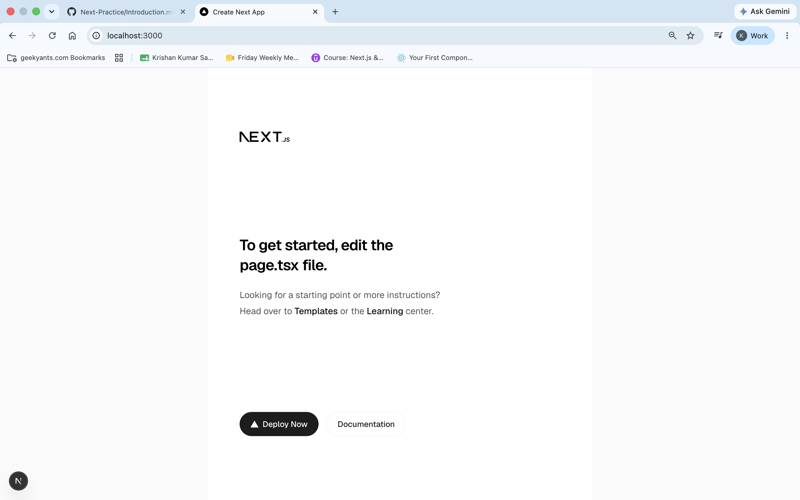

# NEXT JS with Krishan!


### What is Next JS (nextjs.org)

- NextJS is an open source framework built on the top of React to build scalable full-stack applications.
- It blends frontend + backend in the same project
- Routes are configured via filesystem (foldes + files), no code based configuration or extra packages for routing is required.
- All the pages and components are server-side rendered.

---

### Creating First Next App
- you should have node js in your pc/laptop
 - you can visit `https://www.nextjs.org` for all the documentation
 - in your terminal use this command :
    `npx create-next-app@latest`
- navigate to the project you just made, and to start the project use `npm run dev`

[this is the expected new Website]

---
## Two Different Approaches for building Next JS

### -> App Router / Page Router
- Pages Router is old way of using routing techniques and is a very stable way
- With Page Router, we build feature rich full stack apps with React
- App Router is new way as it was introduced in React13
- App Router is marked as stable, but still is relatively new and partially buggy.
- App Router supports modern Next and React features, and is said to be the future of NextJS  


---
### Core Concepts to Learn/Know for NextJS

- Routing, Pages and Components
- Fetching and Sending Data
- Styling, Images and Metadata

---
### Routing in Next JS : 
- To create a new route in NextJS Application, following steps needs to be followed: 

Step 01: Make a folder named of the route you want under the `app/` folder, for example: `app/about` 

Step 02: Make a `page.js` file inside the folder

Step 03: Write the desired output of the `/about` route in page.js


### Navigation 
- For Navigation, you can always use `<a></a>` tags, but it is not preferrable as it breaks the purpose of `SPA` by refreshing and loading a whole new page. 

- To solve this, we can use Link tag provided by "next/Link"

```
import Link from 'next/Link'

export default function Home() {
    <p>
        <Link href = "/awesome"> 
            Click me to go to Awesome 
        </Link>
    </p>
}
```

This will show you a paragraph, which when clicked will lead you to `http://localhost:3000/awesome` without refreshing the page, and thus maintaining `SPA`

---

### Layout 
- Layout is the wrapper in which all the pages are enclosed. 
- One Layout is necessary in which all the children will be dispayed.
- Independent routes can have their own layout.
- In layout, you pass the html code like 

```
export default function RootLayout({children}) {
    <html lang = "en">
        <body>{children}</body>
    </html>
}
```
Notice that `<head>` is not there, but if we want to share some metadata, we can do it by using 

```
export const metadata = {
    title : "Next JS Application", 
    description : "Our First Next App"
}
```
`metadata` here is a reserved keyword and it takes an object as input.

---

### Components

- You can absolutely pack up reusable things into one component and reuse them later as done in react.
- Here also, you can make a component folder, as your wish within the `app/` folder or outside, and place your reusable components there.
- To use them, you can simply 
```
    import Header from '@/components/header'
```

notice we are using `@` here, which denotes the home directory (by default configured by `tsconfig.json` in case you chose `TypeScript` while setting up the project), you can always go for `../` 

---


### Reserved Filenames

These filenames are only reserved when creating them inside of the app/ folder (or any subfolder). Outside of the app/ folder, these filenames are not treated in any special way.

- `page.tsx` : Creating a new page (e.g., `app/about/page.tsx`)
- `layout.tsx` : Creating a new layout that wraps sibling and nested page
- `not-found.tsx` : Fallback page for "Not Found errors"
- `error.tsx` : Fallback page for other errors
- `loading.tsx` : Fallback page which is shown whilst sibling or nested pages are fetching data
- `route.tsx` : Allows you to create an API route (i.e., a page which does NOT return JSX code but instead data, e.g., in the JSON format)

---
